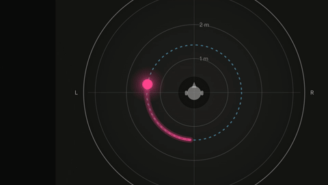
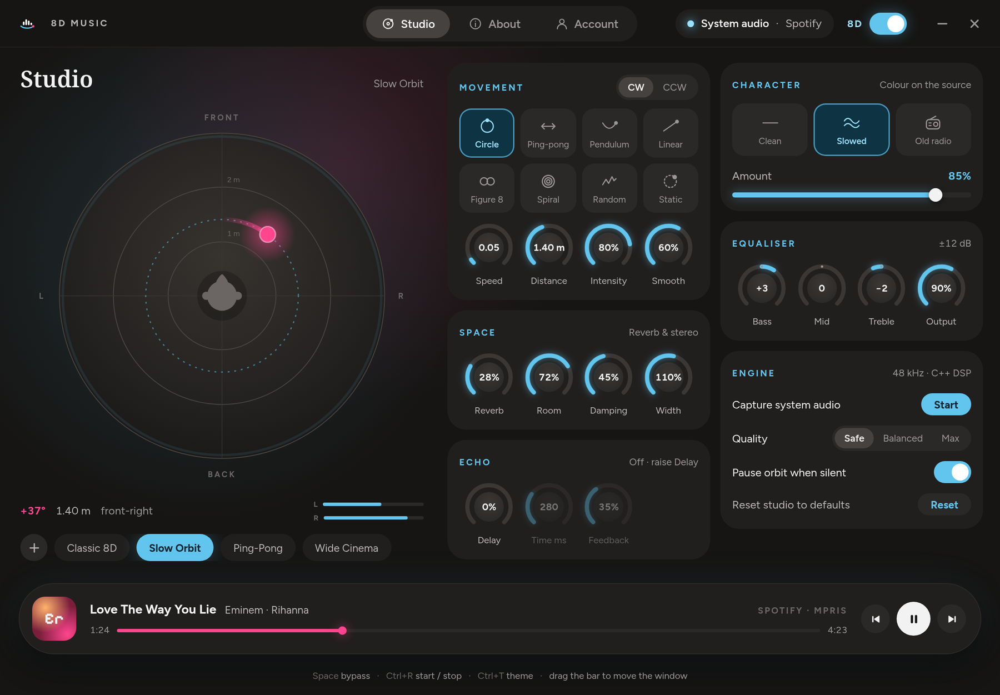
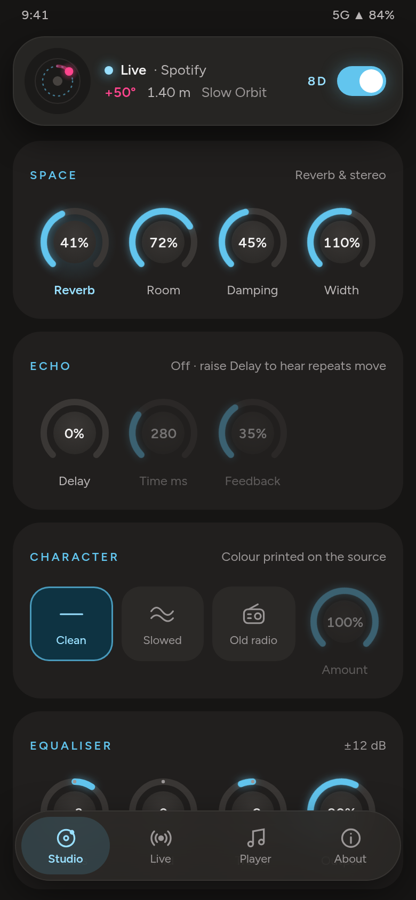
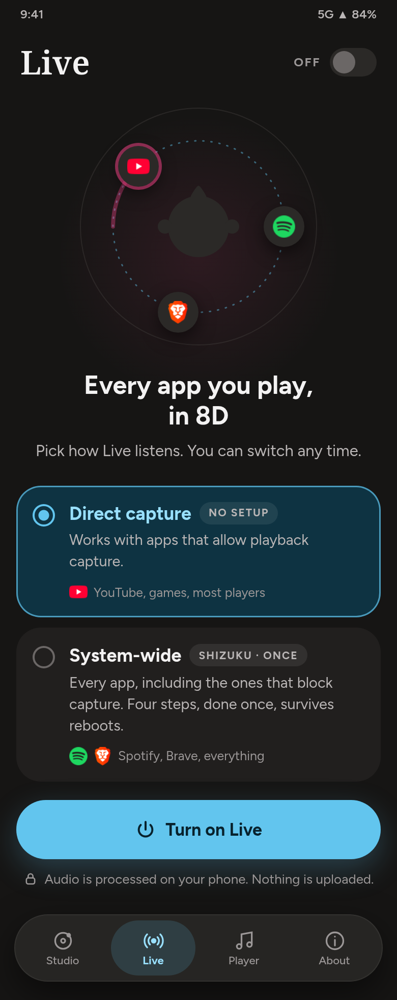
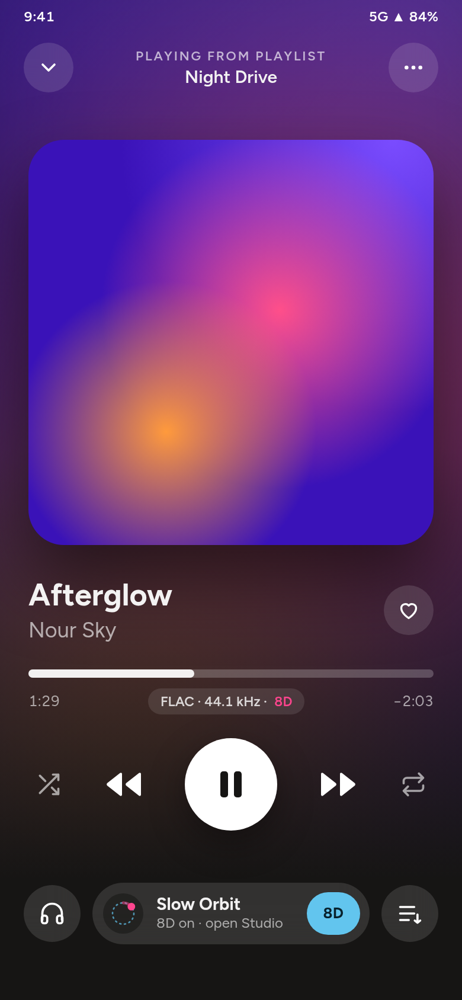

<p align="center">
  
</p>

<p align="center">
  
  
  
  
  
</p>

<p align="center">
  <b>Real-time 8D spatial audio for everything your device plays.</b><br>
  No uploading, no converting, no per-file processing — YouTube, Spotify, games,
  movies, Discord and anything else are spatialised live on their way to your
  headphones.
</p>

<div align="center">
<table>
<tr>
  <td align="center">
    
  </td>
  <td align="center">
    
  </td>
</tr>
<tr>
  <td align="center"><sub><b>Landscape</b> · 16:9 · 40 s</sub></td>
  <td align="center"><sub><b>Vertical</b> · 9:16 · 20 s</sub></td>
</tr>
</table>
</div>

<p align="center"><sub>
  The product film, cut both ways — the same Studio, the same phone screens, the
  same orbit. This is the <a href="#the-interface">design</a> the interface is
  being rebuilt toward; see below for what ships today.
</sub></p>

---

## The effect

The audio is treated as a **virtual sound source orbiting the listener**. Rather
than just swinging the stereo balance, the position is converted into the cues a
real source would produce:

| Cue | What it does |
| --- | --- |
| **Interaural time difference** | The far ear hears the sound up to ~0.7 ms later. This is what pushes the image outside your head instead of leaving it stuck between your ears. |
| **Interaural level difference** | Constant-power panning, so loudness stays steady as the source travels. |
| **Head shadow** | Your skull blocks high frequencies, so the far ear gets a gentle treble roll-off. |
| **Front/back cue** | Positions behind you lose a little upper-mid, the way the outer ear shapes sound from the rear. |
| **Distance** | Level, air absorption and reverb send all follow the orbit radius. |

<p align="center">
  
</p>

Delay times and pan gains are interpolated per sample, so nothing clicks or
zippers while you move the controls.

**Movement modes** — circular orbit, ping-pong, pendulum, linear sweep, figure
eight, spiral, random drift, static position.

**Character** — clean, *slowed & sad* (pitched down), *old radio* (mono,
band-limited, softly saturated, with tape wow and gated hiss).

**Presets** — Classic 8D · Slow Orbit · Ping-Pong · Wide Cinema · Subtle Motion ·
Extreme Spin · Deep Space · Figure Eight · Slowed & Sad · Old Radio

**Controls** — movement speed, orbit radius, effect depth, smoothness, manual
position, stereo width, delay (mix / time / feedback), reverb (mix / room size /
damping), three-band tone, output volume, bypass, reset to defaults.

| Key | Action |
| --- | --- |
| `Space` | Bypass / un-bypass, for A/B |
| `Ctrl+R` | Start / stop the engine |
| `Ctrl+Shift+R` | Reset every effect setting |
| `Ctrl+T` | Switch light / dark |

## One effect, one source file

The effect exists exactly once, in [`cpp/src/dsp/`](cpp/src/dsp/). Every platform
compiles those same files **in place** — nobody keeps a copy. Both native build
files fail loudly if the shared DSP is missing, because the moment one platform
forks the effect, "identical everywhere" becomes a claim nobody can check.

That claim is measured rather than asserted. Each platform renders the same
deterministic probe — 220 Hz, five seconds, all eight movement modes — and the
raw output is compared sample by sample against the Linux build:

| | [Linux](cpp/) | [Android](android/) | [Windows](windows/) |
| --- | --- | --- | --- |
| Status | **ships** | **ships**, tested on hardware | **written, never compiled** |
| Correlation vs Linux | reference | **1.000000** | not yet measured |
| Largest sample difference | — | **0.000006** | not yet measured |
| Reaches system audio via | PipeWire virtual sink | playback capture + Shizuku | native APO in `audiodg` *(untested)* |
| Interface | cairo + Pango on X11 | Kotlin + Compose | Win32 + GDI *(untested)* |
| Install | a single binary, no installer | APK, ~30 MB | installer + one reboot *(unbuilt)* |
| Needs admin / root | no | no root | admin once *(unbuilt)* |

One source file compiled twice, on two operating systems and two CPU
architectures — and the audio still matches to six decimal places. That is a
tighter result than two implementations agreeing, because it is not two
implementations.

> **On Windows.** The code is written and the build is wired to the same shared
> DSP, but **it has never been through a compiler** — no Windows machine, MSVC or
> Windows SDK was available on the development host. Expect build errors. Until
> it compiles and runs the parity probe, there is no honest way to claim it
> sounds the same, so this README does not. See
> [HANDOFF.md](HANDOFF.md#windows--written-never-compiled) for what to expect.

## The interface

One page for the whole effect. The orbit fills the stage on the left, and every
control the DSP exposes — movement, space, echo, character and the equaliser —
sits beside it rather than a tab away.

<p align="center">
  
</p>
<p align="center"><sub>
  <b>Studio, on the desktop.</b> The player floats at the bottom; the window draws
  its own title bar.
</sub></p>

<div align="center">
<table>
<tr>
  <td align="center"></td>
  <td align="center"></td>
  <td align="center"></td>
</tr>
<tr>
  <td align="center"><sub><b>Studio</b></sub></td>
  <td align="center"><sub><b>Live</b></sub></td>
  <td align="center"><sub><b>Player</b></sub></td>
</tr>
</table>
</div>

<p align="center"><sub>
  The same three ideas on the phone, built on the one engine.
</sub></p>

**What ships today looks different.** The interface is mid-rebuild: every control
is there and works, but they are spread across more places than they should be
and there is no way to build playlists yet. The current Linux build is
[`docs/cpp-dark.png`](docs/cpp-dark.png); the full design — Studio, Live, Player
and About, with onboarding and guides — lives in
[`8D Audio Effect Tool UI/`](8D%20Audio%20Effect%20Tool%20UI/).

## Quick start

```bash
git clone git@github.com:MOHAMEDELWAZANI/8DMusic.git
cd 8DMusic
```

### Linux

Nothing to configure, no reboot, no admin.

```bash
sudo apt install build-essential pkg-config libpipewire-0.3-dev \
                 libcairo2-dev libx11-dev libpango1.0-dev libsystemd-dev
cd cpp && make && ./8dmusic
```

Pick your **output device**, press **Start**, play something. Press **Stop**, or
close the window, and your audio goes back to normal. `--check` verifies the
system and lists outputs.

### Android

```bash
cd android && ./gradlew :app:assembleDebug
```

Tested on a Redmi Note 12, Android 14, arm64 — built, installed and heard.

### Windows — not yet buildable

This has never compiled. The commands are here so the next person starts in the
right place, not because they are known to work:

```
cd windows
cmake -B build -A x64
cmake --build build --config Release
```

Getting it to build is [the first open task](HANDOFF.md#immediate-next-steps).

## How each one reaches the audio

The effect is the same everywhere. Getting *to* the audio is the part each
operating system decides for you, and the answers are all different.

**Linux** inserts a virtual output device into the PipeWire graph and makes it
the system default, so every application ends up playing into it:

```
  apps ──▶ [ 8D Music virtual sink ] ──▶ DSP ──▶ your headphones
```

The sink belongs to the running process: kill the app — even with `SIGKILL` —
and PipeWire tears the sink down and your previous default comes back.

**Android** has no equivalent, and offers three routes with different costs, so
the app asks which you want:

| Route | Setup | Reaches |
| --- | --- | --- |
| Local player | none | your own files |
| Direct capture | none | apps that permit playback capture |
| System-wide | Shizuku, once | everything, including apps that block capture |

System-wide works by capturing playback and *silencing the original stream* —
otherwise you hear the dry and spatialised versions at once, which for an effect
built on a sub-millisecond delay between the ears destroys exactly what it is
doing. Silencing needs other apps' audio session ids, which Android will not give
an ordinary app, so Shizuku grants `android.permission.DUMP` **once**. That is an
install permission: it survives reboots and app updates, and Shizuku is never
needed again afterwards.

**Apps that set `ALLOW_CAPTURE_BY_NONE` cannot be processed at all** — Spotify
and Chrome among them. No permission changes this.

**Windows** *(designed, not yet built)* would put the DSP inside the audio engine
itself, as an Audio Processing Object that Windows loads into `audiodg.exe`,
leaving the user's chosen output device chosen and nothing rerouted. Getting an
APO to load at all is the hard part — five things must *all* be true or Windows
skips the effect in silence with no error anywhere. The research is in
[`windows/docs/APO-RESEARCH.md`](windows/docs/APO-RESEARCH.md), and
[HANDOFF.md](HANDOFF.md) weighs it against a simpler WASAPI-loopback route.

## Now playing

Every build shows what you are actually listening to — title, artists, elapsed
time — with skip and play/pause that drive the player itself, not the effect.

| | Reads from |
| --- | --- |
| Linux | MPRIS over the session bus |
| Android | `MediaSessionManager` |

Nothing leaves the machine.

<p align="center">
  
</p>

Titles are tidied on the way in, because uploaders put far more than the song
name in them: `Eminem - Love The Way You Lie ft. Rihanna` from a `- Topic`
channel becomes **Love The Way You Lie** by **Eminem · Rihanna**. The cover is a
lettered tile — two artists give their initials, one artist gives its opening
pair.

Arabic needs shaping and reordering before it can be drawn; the Linux build hands
that to Pango, which also covers every other script and falls back when a face
lacks a glyph.

One limit worth stating plainly: only apps that publish a media session appear.
Spotify does, and Chromium browsers report whatever a page declares. Discord and
most games do not — they will read as *nothing playing* while plainly audible.
That is the API's boundary, not a bug.

## Measured

The parity probe is the project's own check that the builds agree:

```bash
# Linux — build the reference and render every mode
g++ -std=c++20 -O3 -ffast-math -fno-math-errno \
    -o dsp_probe cpp/tests/dsp_probe.cpp cpp/src/dsp/Processor.cpp -Icpp/src/dsp

# compare any two sets of dumps
python3 cpp/tests/compare_f32.py REFERENCE_DIR CANDIDATE_DIR
```

Android runs the identical probe from the app; the output is pulled with `adb`.
Windows has [`windows/parity.ps1`](windows/parity.ps1) waiting for the day the
build compiles.

Compiler flags are matched deliberately — `-O3 -ffast-math -fno-math-errno` on
GCC and Clang, `/O2 /fp:fast` on MSVC — because parity to six decimal places is
only meaningful if the arithmetic is allowed to be the same.

Performance and method for the Linux build are in
**[BENCHMARK.md](BENCHMARK.md)**.

## Where it stands

| | |
| --- | --- |
| **Linux** | Works. The reference build. |
| **Android** | Works on hardware — all three capture routes, all ten presets, measured identical to Linux. |
| **Windows** | Written, never compiled. Nothing there can be trusted until it builds. |
| **Interface** | Mid-rebuild. Everything is reachable; the layout is not yet the design. |
| **Playlists** | Not built. |

[HANDOFF.md](HANDOFF.md) is the working record: what is done, what is known to be
missing, and the things not worth rediscovering.

## Layout

```
8DMusic/
├── README.md            this file
├── BENCHMARK.md         how the effect performs, and how that was measured
├── HANDOFF.md           where each build stands, for picking the work back up
├── assets/              cover, logo lockups, and the product film as GIFs
├── docs/                screenshots, and the UI exports under docs/design/
│
├── cpp/                 Linux — see cpp/README.md
│   ├── src/dsp/         THE EFFECT. shared by every build
│   ├── src/audio/       PipeWire graph, engine, MPRIS over sd-bus
│   ├── src/ui/          X11 + cairo + Pango
│   └── tests/           the parity probe and its comparison script
│
├── android/             Android — see android/README.md
│   ├── app/src/main/cpp/        JNI bridge, AAudio engine
│   └── app/src/main/java/       Compose UI, capture service, Shizuku
│
└── windows/             Windows — written, never compiled
    ├── src/apo/         the APO Windows would load into audiodg
    ├── src/gui/         the control window
    ├── src/shared/      shared memory between the two
    ├── installer/       registration, and the uninstaller that reverses it
    └── docs/            APO-RESEARCH.md and RECOVERY.md
```

## Requirements

Use **headphones**. The effect relies on each ear hearing a different signal;
speakers blend them together and most of it disappears.

| | |
| --- | --- |
| **Linux** | PipeWire — Ubuntu 22.10+, Fedora 34+, most current distros |
| **Android** | 10 or newer. System-wide mode additionally needs Shizuku, once |
| **Windows** | Not yet buildable — see above |
