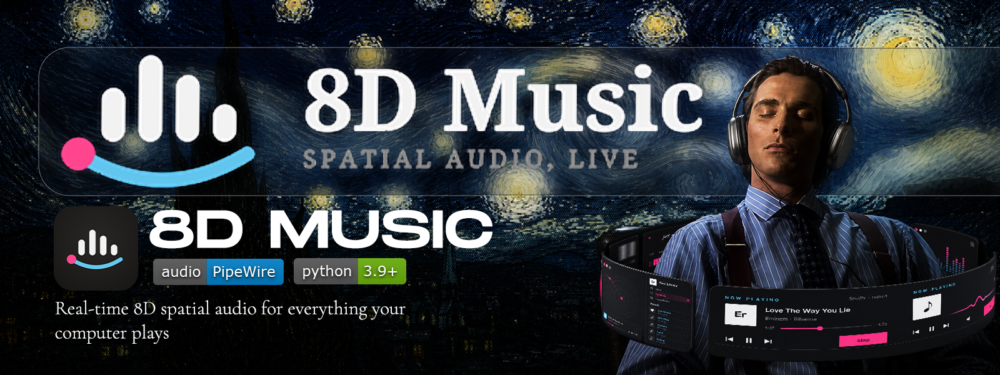
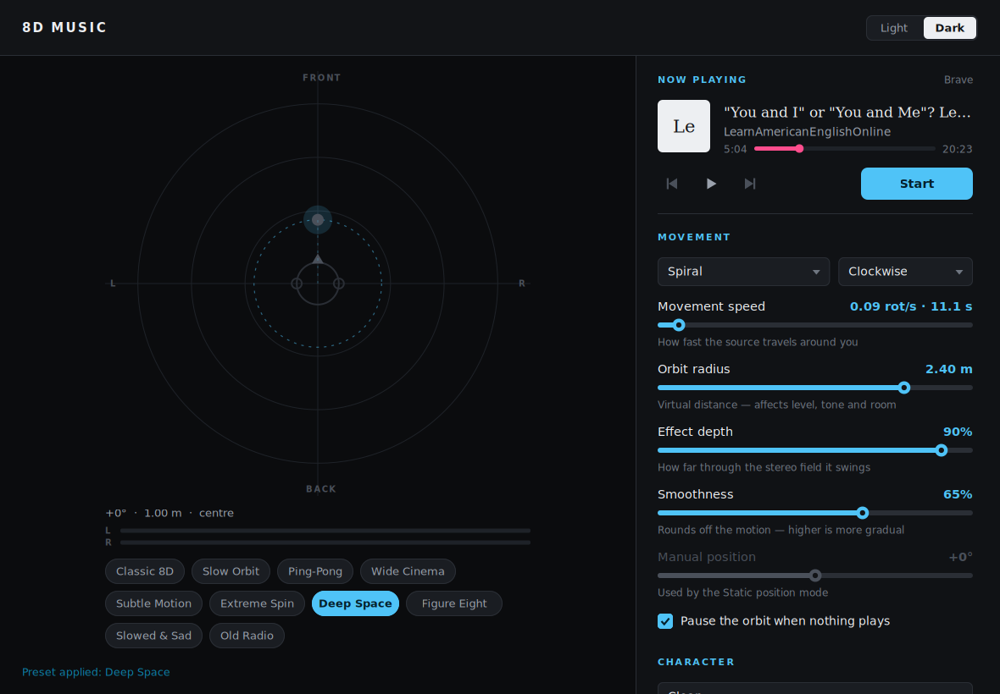
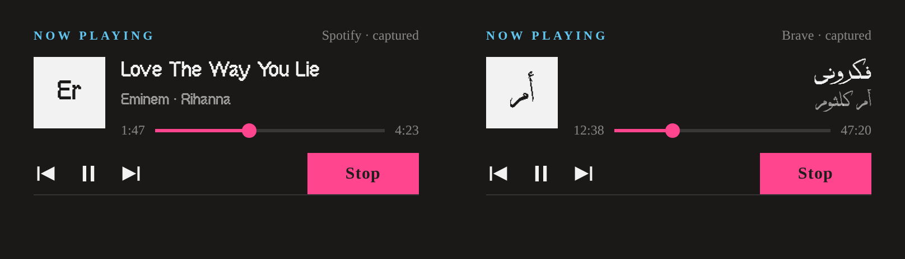

<p align="center">
  
</p>

<p align="center">
  
  
  
  
</p>

<p align="center">
  <b>Real-time 8D spatial audio for everything your computer plays.</b><br>
  No uploading, no converting, no per-file processing — YouTube, Spotify, games,
  movies, Discord and anything else are spatialised live on their way to your
  headphones.
</p>

---

## Two builds, one effect

The same tool exists twice. The **Python** build came first and is the reference
implementation; the **C++** build is a rewrite that keeps the effect bit-for-bit
and rebuilds everything around it.

They are not two different products. Pushed the same audio, they agree to a
correlation of **1.0000**, with a largest sample difference of 0.0006 — so the
choice between them is a choice about cost, not about sound.

| | [Python](python/) | [C++](cpp/) |
| --- | --- | --- |
| Install | `.venv` with NumPy + SciPy, **271 MB** | one **443 KB** binary |
| Needs a compiler | no | yes, once |
| Interface | Tk, hand-drawn | cairo + Pango on X11 |
| Audio path | virtual sink → `pw-record` → pipe → DSP → pipe → `pw-play` | two native `pw_stream`s, in process |
| Helper processes while running | 4 | **0** |
| CPU, audio path | 23.6 % of a core | **2.6 %** |
| CPU, window open and idle | 20.5 % | **0.5 %** |
| Memory | 121–135 MB | **37–43 MB** |
| Arabic text | shaped and reordered by hand in `bidi.py` | Pango, plus fallback for any script |

**Which should you run?** The C++ build, if you can spend one `apt install` and
17 seconds compiling — it costs about a tenth as much and starts in a tenth the
time. The Python build if you want to read or change the code quickly, or if a
compiler is not available. Neither is a downgrade in sound.

<p align="center">
  
</p>
<p align="center"><sub>The C++ build. The rail scrolls — a taller window shows the rest of it.</sub></p>

## Quick start

```bash
git clone git@github.com:MOHAMEDELWAZANI/8DMusic.git
cd 8DMusic
```

**C++**

```bash
sudo apt install build-essential pkg-config libpipewire-0.3-dev \
                 libcairo2-dev libx11-dev libpango1.0-dev libsystemd-dev
cd cpp && make && ./8dmusic
```

**Python**

```bash
cd python && ./run.sh          # first run builds .venv, then it starts at once
```

Either way: pick your **output device**, press **Start**, and play something.
Press **Stop**, or close the window, and your audio goes back to normal. Both
builds accept `--check` to verify the system and list outputs.

## How it works

The app inserts a virtual output device into the audio graph and makes it the
system default, so every application ends up playing into it:

```
  apps ──▶ [ 8D Music virtual sink ] ──▶ DSP ──▶ your speakers
```

Because the effect sits at the very end of the chain, it applies to all sound at
once and needs no cooperation from the apps producing it. The virtual sink
belongs to the running process: if the app is killed — even with `SIGKILL` —
PipeWire tears the sink down and your previous default device comes back.

The two builds differ only in how the audio gets from that sink to the DSP and
back out. Python carries it through `pw-record` and `pw-play` subprocesses and
kernel pipes; C++ runs both ends as native `pw_stream`s in one process, with the
DSP inside PipeWire's realtime callback.

## The effect

The audio is treated as a **virtual sound source orbiting the listener**. Rather
than just swinging the stereo balance, the position is converted into the cues a
real source would produce:

| Cue | What it does |
| --- | --- |
| **Interaural time difference** | The far ear hears the sound up to ~0.7 ms later. This is what pushes the image outside your head instead of leaving it stuck between your ears. |
| **Interaural level difference** | Constant-power panning, so loudness stays steady as the source travels. |
| **Head shadow** | Your skull blocks high frequencies, so the far ear gets a gentle treble roll-off. |
| **Front/back cue** | Positions behind you lose a little upper-mid, the way the outer ear shapes sound from the rear. |
| **Distance** | Level, air absorption and reverb send all follow the orbit radius. |

Delay times and pan gains are interpolated per sample, so nothing clicks or
zippers while you move the controls.

**Movement modes** — circular orbit, ping-pong, pendulum, linear sweep, figure
eight, spiral, random drift, static position.

**Character** — clean, *slowed & sad* (pitched down), *old radio* (mono,
band-limited, softly saturated, with tape wow and gated hiss).

**Presets** — Classic 8D · Slow Orbit · Ping-Pong · Wide Cinema · Subtle Motion ·
Extreme Spin · Deep Space · Figure Eight · Slowed & Sad · Old Radio

**Controls** — movement speed, orbit radius, effect depth, smoothness, manual
position, stereo width, delay (mix / time / feedback), reverb (mix / room size /
damping), output volume, bypass, reset to defaults.

| Key | Action |
| --- | --- |
| `Space` | Bypass / un-bypass, for A/B |
| `Ctrl+R` | Start / stop the engine |
| `Ctrl+Shift+R` | Reset every effect setting |
| `Ctrl+T` | Switch light / dark |

## Now playing

Both builds show what you are actually listening to — title, artists, elapsed
time — with skip and play/pause that drive the player itself, not the effect.
It reads MPRIS from the session bus, so Spotify, Firefox, Chrome/Brave, VLC, mpv
and Rhythmbox all work with nothing to configure. Nothing leaves the machine.

<p align="center">
  
</p>

Titles are tidied on the way in, because uploaders put far more than the song
name in them: `Eminem - Love The Way You Lie ft. Rihanna` from a `- Topic`
channel becomes **Love The Way You Lie** by **Eminem · Rihanna**. The cover is a
lettered tile — two artists give their initials, one artist gives its opening
pair.

Arabic needs shaping and reordering before it can be drawn. The Python build
does both by hand in [`bidi.py`](python/eight_d/bidi.py), reading the contextual
letter forms out of `unicodedata`; the C++ build hands the problem to Pango,
which also covers every other script and falls back when a face lacks a glyph.

## Measured

Full method, spreads and caveats in **[BENCHMARK.md](BENCHMARK.md)** — runs are
interleaved and reported as medians, on a machine that was explicitly not quiet.

| | Python | C++ | |
| --- | ---: | ---: | ---: |
| DSP, share of real time | 12.8–15.7 % | 0.43–0.67 % | **29× faster** |
| Whole audio path, CPU | 23.6 % | 2.6 % | 9.0× less |
| Latency added by the effect | 21.7 ms | ~3.5 ms | ~18 ms less |
| Time to window | 1601 ms | 91 ms | 17.6× faster |
| CPU idle, window open | 20.5 % | 0.5 % | 41× less |
| Install size | 271 MB | 443 KB | |

Most of that is architecture rather than language: no helper processes, no
`pw-dump` polling, and an interface that draws only when something changed. The
DSP is the one place where the language itself dominates.

```bash
cd cpp/bench
REPS=5 python3 dsp_bench.py      # the effect itself
REPS=3 python3 audio_bench.py    # the whole audio path
REPS=5 python3 latency_bench.py  # delay added by the effect
REPS=3 python3 gui_bench.py      # the interface
```

## Layout

```
8DMusic/
├── README.md            this file
├── BENCHMARK.md         how the two builds compare, and how that was measured
├── assets/              cover and logo lockups
├── docs/                screenshots, and the UI exports under docs/design/
├── python/              the reference build — see python/README.md
│   ├── eight_d/         dsp, engine, pipewire, ui, nowplaying, bidi
│   └── run.sh
└── cpp/                 the rewrite — see cpp/README.md
    ├── src/dsp/         the effect, allocation-free
    ├── src/audio/       PipeWire graph, engine, MPRIS over sd-bus
    ├── src/ui/          X11 + cairo + Pango
    └── bench/           the benchmark harness
```

## Requirements

Linux with **PipeWire** — Ubuntu 22.10+, Fedora 34+ and most current distros.
Use **headphones**: the effect relies on each ear hearing a different signal, and
speakers blend them together.

## Roadmap

A **mobile** build is next, and will sit alongside these two.
